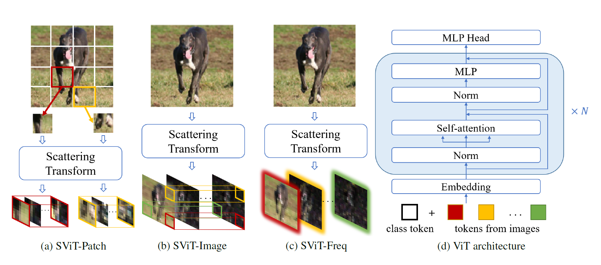

# SViT: Hybrid Vision Transformer Models With Scattering Transform

by [Tianming Qiu](https://github.com/TianmingQiu), [Ming Gui](https://github.com/mgui7), [Cheng Yan](https://github.com/ChengYan97), [Ziqing Zhao](https://github.com/ZiqingZhao), [Hao Shen](https://www.fortiss.org/forschung/projekte/detail/machine-learning-lab).

## Table of Contents
0. [Introduction](#introduction)
0. [Release Notes](#Release Notes)
0. [Prerequisites](#Prerequisites)
0. [Model Zoo](#Model Zoo)
0. [Bibtex](#Bibtex)
0. [License](#License)

## Introduction

Overview of the model: we propose hybrid ViT models with scattering transform called Scattering Vision Transformer (SViT). More specifically, we investigate three tokenizations using scattering transform for ViT: patch-wise scattering tokens (SViTPatch), scattering image feature tokens (SViT-Image), and scattering frequency sub-band response tokens (SViT-Freq). 

## Release Notes
List of Releases in reverse chronological order (= latest up top):
- **Release 1.0**, 22.06.2022
    - Git tag: release_v1_0
    - ...

## Prerequisites
- Windows/Linux
- Python Version: 
- CUDA/cudnn Version: 
- Environment (Anaconda, ...):  
- etc. (Everything except python pkgs - those shall be stated in the requirements.txt)

#### Installation

*- Clone repository and install Python dependencies*
```sh
$ git clone https://github.com/TianmingQiu/scattering_transformer
$ cd scattering_transformer
$ pip install -r requirements.txt 
```

#### Setup local data directory

*- Download the dataset*
```sh
$ cd input/dataset
```
*- Configure the hyperparameters of the model in the "custom_dataset.py" (if needed)*

#### Used Dataset
- CIFAR10 
- STL10
- Flowers (inverse train and test set)
- EuroSAT

## Model Zoo

| Model Name | Backbone | **Size/GPU**     
| ------ | ------ |------ 
| [**ViT**](https://github.com/google-research/vision_transformer) | ViT | - GB  
| **SViT_Patch**| ViT |  - GB   
| **SViT-Image** | ViT | - GB    
| **SViT-Freq** | ViT | - GB  

## Bibtex

```
@article{
}
```

## License


